# 시스템 아키텍처 문서

캠핑장 예약 알림 시스템의 전체 아키텍처를 설명합니다.

## 목차
1. [시스템 개요](#시스템-개요)
2. [전체 아키텍처](#전체-아키텍처)
3. [컴포넌트 구조](#컴포넌트-구조)
4. [데이터 흐름](#데이터-흐름)
5. [시퀀스 다이어그램](#시퀀스-다이어그램)
6. [데이터베이스 설계](#데이터베이스-설계)
7. [배포 아키텍처](#배포-아키텍처)
8. [보안 아키텍처](#보안-아키텍처)

---

## 시스템 개요

```mermaid
graph TB
    subgraph "사용자"
        USER[사용자]
    end

    subgraph "Frontend"
        WEB[React Web App]
    end

    subgraph "Backend"
        API[Express API Server]
        SCHEDULER[Node-Cron Scheduler]
        SCRAPER[Playwright Scraper]
    end

    subgraph "External Services"
        FIREBASE[Firebase Auth]
        FIRESTORE[Firestore Database]
        GMAIL[Gmail SMTP]
        TARGET[캠핑장 웹사이트]
    end

    USER --> WEB
    WEB --> API
    API --> FIREBASE
    API --> FIRESTORE
    SCHEDULER --> SCRAPER
    SCRAPER --> TARGET
    SCRAPER --> FIRESTORE
    API --> GMAIL

    style USER fill:#e1f5fe
    style WEB fill:#fff3e0
    style API fill:#f3e5f5
    style SCHEDULER fill:#e8f5e9
    style SCRAPER fill:#fce4ec
    style FIREBASE fill:#ffebee
    style FIRESTORE fill:#e0f2f1
    style GMAIL fill:#fff9c4
    style TARGET fill:#f1f8e9
```



### 주요 특징
- **프론트엔드**: React 기반 SPA (Single Page Application)
- **백엔드**: Node.js Express REST API
- **스케줄러**: 10분마다 자동 스크래핑 실행
- **스크래핑**: Playwright 헤드리스 브라우저
- **인증**: Firebase Authentication
- **데이터베이스**: Firestore NoSQL
- **알림**: Gmail SMTP 이메일

---

## 전체 아키텍처

### 레이어드 아키텍처


---

## 컴포넌트 구조

### Backend 컴포넌트 다이어그램


### Frontend 컴포넌트 다이어그램


---

## 데이터 흐름

### 사용자 등록 및 로그인 흐름

```mermaid
sequenceDiagram
    participant U as 사용자
    participant F as Frontend
    participant FB as Firebase Auth
    participant API as Backend API
    participant FS as Firestore

    U->>F: 1. 이메일/비밀번호 입력
    F->>FB: 2. signInWithEmailAndPassword()
    FB-->>F: 3. ID Token 반환
    F->>API: 4. POST /api/auth/verify<br/>(Bearer Token)
    API->>FB: 5. verifyIdToken()
    FB-->>API: 6. Decoded Token (uid, email)
    API->>FS: 7. getOrCreateUser(uid)
    FS-->>API: 8. User Document
    API-->>F: 9. { success: true, user: {...} }
    F->>F: 10. AuthContext 업데이트
    F-->>U: 11. Dashboard로 리다이렉트

    Note over F,FS: 모든 API 요청에 Bearer Token 포함
```



### 알림 설정 생성 흐름

```mermaid
sequenceDiagram
    participant U as 사용자
    participant F as Frontend
    participant API as Backend API
    participant FS as Firestore

    U->>F: 1. 설정 양식 작성<br/>(캠핑장, 날짜, 구역)
    F->>F: 2. 입력 유효성 검사
    F->>API: 3. POST /api/settings<br/>{ campingName, dateFrom, dateTo, area[] }
    API->>API: 4. authenticateUser middleware
    API->>API: 5. dateFrom 필수 검증
    API->>FS: 6. createUserSetting(uid, data)
    FS->>FS: 7. settings Collection에 저장<br/>(isActive: true)
    FS-->>API: 8. Created Document ID
    API-->>F: 9. { success: true, data: {...} }
    F->>F: 10. 설정 목록 새로고침
    F-->>U: 11. 성공 메시지 표시

    Note over FS: 설정은 기본적으로 활성화 상태로 생성됨
```



### 스크래핑 및 알림 전체 흐름


### 예약 가능 현황 조회 흐름

```mermaid
sequenceDiagram
    participant U as 사용자
    participant F as Frontend
    participant API as Backend API
    participant FS as Firestore

    U->>F: 1. Dashboard 접속
    F->>API: 2. GET /api/availability<br/>(Bearer Token)
    API->>API: 3. authenticateUser middleware
    API->>FS: 4. getUserSettings(uid)
    FS-->>API: 5. User Settings[]

    API->>API: 6. activeSettings 필터링<br/>(isActive: true)

    alt 활성 설정 없음
        API-->>F: 7. { success: true, data: [] }
    else 활성 설정 존재
        API->>FS: 8. getAvailability({})
        FS-->>API: 9. All Availability[]

        loop 각 설정별
            API->>API: 10. matchesSetting()<br/>(캠핑장, 지역, 구역, 날짜 범위 매칭)
        end

        API->>API: 11. 중복 제거 (Set)<br/>availableCount > 0만 포함
        API-->>F: 12. { success: true, data: [...] }
    end

    F->>F: 13. AvailableSites 컴포넌트 렌더링
    F-->>U: 14. 예약 가능 사이트 목록 표시

    Note over API: 사용자 설정 조건에 맞는 항목만 반환
```



---

## 시퀀스 다이어그램

### 스크래핑 상세 시퀀스

```mermaid
sequenceDiagram
    participant S as Scraper Service
    participant B as Playwright Browser
    participant T as 캠핑장 웹사이트
    participant F as Firestore

    S->>F: 1. createScrapingLog({ status: 'running' })
    F-->>S: 2. logId

    S->>S: 3. getMonthsFromSettings() 또는<br/>getMonthsToScrape() (기본 3개월)

    S->>B: 4. chromium.launch({ headless: true })
    B-->>S: 5. browser instance

    S->>B: 6. newContext() + newPage()
    B-->>S: 7. page instance

    loop 각 월 (YYYY-MM)
        S->>B: 8. page.goto(url + month)
        B->>T: 9. HTTP GET
        T-->>B: 10. HTML 응답
        B-->>S: 11. Page loaded

        S->>B: 12. waitForTimeout(2000ms)

        S->>B: 13. page.$$('div[id]')<br/>(날짜 DIV 검색)
        B-->>S: 14. Date DIVs[]

        loop 각 날짜 DIV
            S->>S: 15. datePattern.test(id)<br/>(YYYY-MM-DD 검증)

            alt ID가 날짜 형식
                S->>B: 16. dateDiv.$$('dl.schedule')
                B-->>S: 17. DL elements[]

                loop 각 DL 요소
                    S->>B: 18. dl.$('dt')<br/>(예약 가능 수)
                    S->>B: 19. dl.$('dd')<br/>(구역명)
                    B-->>S: 20. availableCount, areaName
                    S->>S: 21. availabilityData.push()
                end
            end
        end

        S->>S: 22. 데이터에 campingName, region 추가
    end

    S->>F: 23. batchSaveAvailability(allData[])
    F->>F: 24. Batch Write (500개씩)
    F-->>S: 25. 저장 완료

    S->>B: 26. browser.close()

    S->>F: 27. updateScrapingLog({<br/>status: 'success',<br/>itemsScraped: count<br/>})

    Note over S,F: 에러 발생 시 status: 'error'로 기록
```



### 알림 발송 상세 시퀀스

```mermaid
sequenceDiagram
    participant N as Notification Service
    participant F as Firestore
    participant R as Retry Module
    participant E as Gmail SMTP
    participant U as 사용자

    N->>F: 1. getAllActiveSettings()
    F-->>N: 2. Active Settings[]

    loop 각 설정별
        N->>N: 3. matchesCriteria(availability, setting)

        alt 조건 일치하는 항목 있음
            N->>F: 4. hasSettingNotified(settingId)<br/>notifications 컬렉션 조회
            F-->>N: 5. boolean (이미 알림 발송 여부)

            alt 이미 알림 발송됨
                N->>F: 6. updateUserSetting()<br/>(isActive: false 재확인)
                N->>N: 7. continue to next setting
            else 첫 알림
                N->>F: 8. users.doc(userId).get()
                F-->>N: 9. User Document<br/>(email, notificationEmail)

                N->>N: 10. HTML 이메일 생성<br/>(캠핑장 정보, 날짜, 예약 가능 수)

                N->>R: 11. retryStrategies.email(<br/>sendEmail(to, subject, html))

                loop 최대 2회 재시도
                    R->>E: 12. nodemailer.sendMail()

                    alt 이메일 발송 성공
                        E-->>U: 13. 이메일 수신 ✉️
                        E-->>R: 14. Success
                        R-->>N: 15. Success
                    else 발송 실패
                        E-->>R: 16. Error
                        R->>R: 17. 5초 대기
                    end
                end

                alt 이메일 발송 성공
                    N->>F: 18. saveNotification({<br/>userId, settingId,<br/>campingName, area, date<br/>})

                    N->>F: 19. updateUserSetting()<br/>(isActive: false)

                    Note over N,F: 설정은 자동으로 비활성화됨 (1회성 알림)
                else 모든 재시도 실패
                    N->>N: 20. Error 로깅
                    N->>N: 21. throw EmailError
                end
            end
        end
    end
```



---

## 데이터베이스 설계

### Firestore 컬렉션 구조

```mermaid
erDiagram
    USERS ||--o{ USER_SETTINGS : "1:N"
    USERS ||--o{ NOTIFICATIONS : "1:N"
    USER_SETTINGS ||--o{ NOTIFICATIONS : "1:N"
    AVAILABILITY }o--|| CAMPING_SITES : "N:1"
    SCRAPING_LOGS }o--|| SYSTEM : "N:1"
    NOTIFICATIONS }o--|| SYSTEM : "N:1"

    USERS {
        string uid PK "Firebase UID"
        string email "사용자 이메일"
        string displayName "표시 이름"
        string notificationEmail "알림 받을 이메일"
        string pushToken "FCM 토큰"
        timestamp createdAt "생성 시각"
        timestamp updatedAt "수정 시각"
    }

    USER_SETTINGS {
        string id PK "문서 ID"
        string userId FK "사용자 UID"
        string campingName "캠핑장명"
        string region "지역"
        array area "구역 목록"
        date dateFrom "시작 날짜"
        date dateTo "종료 날짜"
        boolean isActive "활성화 여부"
        timestamp createdAt "생성 시각"
        timestamp updatedAt "수정 시각"
    }

    AVAILABILITY {
        string id PK "문서 ID"
        string campingName "캠핑장명"
        string region "지역"
        string area "구역"
        date date "날짜"
        number availableCount "예약 가능 수"
        timestamp scrapedAt "스크래핑 시각"
    }

    NOTIFICATIONS {
        string id PK "문서 ID"
        string userId FK "사용자 UID"
        string settingId FK "설정 ID"
        string campingName "캠핑장명"
        string area "구역"
        date date "날짜"
        number availableCount "예약 가능 수"
        string notificationType "알림 유형"
        timestamp sentAt "발송 시각"
    }

    SCRAPING_LOGS {
        string id PK "문서 ID"
        timestamp startedAt "시작 시각"
        timestamp completedAt "완료 시각"
        string status "상태 (running/success/error)"
        number itemsScraped "스크래핑된 항목 수"
        string errorMessage "에러 메시지"
    }

    CAMPING_SITES {
        string name "캠핑장명"
        string region "지역"
        string url "웹사이트 URL"
    }

    SYSTEM {
        string version "시스템 버전"
    }
```



### Firestore 인덱스 전략


---

## 배포 아키텍처

### 개발 환경 배포

```mermaid
graph TB
    subgraph "Local Development"
        DEV_FE[Frontend Dev Server<br/>Vite :5173]
        DEV_BE[Backend Dev Server<br/>Node.js :3000]
    end

    subgraph "Firebase Project (Development)"
        DEV_AUTH[Firebase Auth<br/>Development]
        DEV_FS[Firestore<br/>Development Database]
    end

    subgraph "External Services"
        DEV_GMAIL[Gmail SMTP<br/>Test Account]
        DEV_TARGET[캠핑장 웹사이트]
    end

    DEV_FE -->|API Calls| DEV_BE
    DEV_FE -->|Auth| DEV_AUTH
    DEV_BE -->|Auth Verify| DEV_AUTH
    DEV_BE -->|Data CRUD| DEV_FS
    DEV_BE -->|Scraping| DEV_TARGET
    DEV_BE -->|Email| DEV_GMAIL

    style DEV_FE fill:#e3f2fd
    style DEV_BE fill:#f3e5f5
    style DEV_AUTH fill:#fff3e0
    style DEV_FS fill:#e8f5e9
    style DEV_GMAIL fill:#fce4ec
    style DEV_TARGET fill:#ffebee
```



### 프로덕션 배포 아키텍처


### CI/CD 파이프라인


---

## 보안 아키텍처

### 인증 및 인가 플로우

```mermaid
graph TB
    subgraph "Client"
        USER[User Browser]
        FB_SDK[Firebase Client SDK]
    end

    subgraph "Authentication Layer"
        FB_AUTH[Firebase Authentication]
    end

    subgraph "Backend API"
        AUTH_MW[authenticateUser<br/>Middleware]
        ROUTE[Route Handler]
    end

    subgraph "Data Layer"
        FS[Firestore]
    end

    USER -->|1. Login| FB_SDK
    FB_SDK -->|2. signIn| FB_AUTH
    FB_AUTH -->|3. ID Token| FB_SDK
    FB_SDK -->|4. Store Token| USER

    USER -->|5. API Request<br/>Authorization: Bearer {token}| AUTH_MW
    AUTH_MW -->|6. verifyIdToken| FB_AUTH
    FB_AUTH -->|7. Decoded Token<br/>(uid, email)| AUTH_MW

    AUTH_MW -->|8. req.user = decoded| ROUTE
    ROUTE -->|9. Query with uid| FS
    FS -->|10. User's Data Only| ROUTE
    ROUTE -->|11. Response| USER

    style USER fill:#e3f2fd
    style FB_SDK fill:#fff3e0
    style FB_AUTH fill:#f3e5f5
    style AUTH_MW fill:#e8f5e9
    style ROUTE fill:#fce4ec
    style FS fill:#ffebee
```

### 보안 계층 다이어그램


### Firestore 보안 규칙

```mermaid
graph TB
    subgraph "Firestore Security Rules"
        RULE_USER[users Collection]
        RULE_SETTINGS[userSettings Collection]
        RULE_AVAIL[availability Collection]
        RULE_NOTIF[notifications Collection]
        RULE_LOGS[scrapingLogs Collection]
    end

    subgraph "Access Control"
        USER_READ[Read: Own Document Only]
        USER_WRITE[Write: Own Document Only]
        SETTINGS_READ[Read: Own Settings Only]
        SETTINGS_WRITE[Write: Own Settings Only]
        AVAIL_READ[Read: All (Authenticated)]
        AVAIL_WRITE[Write: Server Only]
        NOTIF_READ[Read: Own Notifications Only]
        NOTIF_WRITE[Write: Server Only]
        LOGS_READ[Read: Admin Only]
        LOGS_WRITE[Write: Server Only]
    end

    RULE_USER --> USER_READ
    RULE_USER --> USER_WRITE
    RULE_SETTINGS --> SETTINGS_READ
    RULE_SETTINGS --> SETTINGS_WRITE
    RULE_AVAIL --> AVAIL_READ
    RULE_AVAIL --> AVAIL_WRITE
    RULE_NOTIF --> NOTIF_READ
    RULE_NOTIF --> NOTIF_WRITE
    RULE_LOGS --> LOGS_READ
    RULE_LOGS --> LOGS_WRITE

    style RULE_USER fill:#e3f2fd
    style RULE_SETTINGS fill:#fff3e0
    style RULE_AVAIL fill:#f3e5f5
    style RULE_NOTIF fill:#e8f5e9
    style RULE_LOGS fill:#fce4ec
    style USER_READ fill:#c8e6c9
    style USER_WRITE fill:#ffccbc
    style SETTINGS_READ fill:#c8e6c9
    style SETTINGS_WRITE fill:#ffccbc
    style AVAIL_READ fill:#c8e6c9
    style AVAIL_WRITE fill:#b0bec5
    style NOTIF_READ fill:#c8e6c9
    style NOTIF_WRITE fill:#b0bec5
    style LOGS_READ fill:#fff9c4
    style LOGS_WRITE fill:#b0bec5
```

---

## 에러 처리 아키텍처

### 에러 처리 플로우

```mermaid
graph TB
    subgraph "Error Sources"
        ROUTE_ERR[Route Handler Error]
        SERVICE_ERR[Service Layer Error]
        EXTERNAL_ERR[External API Error]
        VALIDATION_ERR[Validation Error]
    end

    subgraph "Error Classification"
        APP_ERR[AppError<br/>Base Class]
        AUTH_ERR[AuthenticationError<br/>401]
        DB_ERR[DatabaseError<br/>500]
        SCRAPER_ERR[ScraperError<br/>500]
        EMAIL_ERR[EmailError<br/>500]
        VALIDATION_ERR2[ValidationError<br/>400]
        RATE_ERR[RateLimitError<br/>429]
    end

    subgraph "Error Handling"
        ERROR_MW[Error Middleware]
        LOGGER[Winston Logger]
        FORMAT[formatErrorResponse()]
    end

    subgraph "Response"
        PROD_RES[Production Response<br/>No Stack Trace]
        DEV_RES[Development Response<br/>Full Stack Trace]
        LOG_FILE[Log File<br/>combined.log]
    end

    ROUTE_ERR --> APP_ERR
    SERVICE_ERR --> APP_ERR
    EXTERNAL_ERR --> APP_ERR
    VALIDATION_ERR --> VALIDATION_ERR2

    APP_ERR --> AUTH_ERR
    APP_ERR --> DB_ERR
    APP_ERR --> SCRAPER_ERR
    APP_ERR --> EMAIL_ERR
    APP_ERR --> VALIDATION_ERR2
    APP_ERR --> RATE_ERR

    AUTH_ERR --> ERROR_MW
    DB_ERR --> ERROR_MW
    SCRAPER_ERR --> ERROR_MW
    EMAIL_ERR --> ERROR_MW
    VALIDATION_ERR2 --> ERROR_MW
    RATE_ERR --> ERROR_MW

    ERROR_MW --> LOGGER
    ERROR_MW --> FORMAT

    LOGGER --> LOG_FILE

    FORMAT -->|NODE_ENV=production| PROD_RES
    FORMAT -->|NODE_ENV=development| DEV_RES

    style ROUTE_ERR fill:#ffebee
    style APP_ERR fill:#fce4ec
    style ERROR_MW fill:#f3e5f5
    style LOGGER fill:#e8f5e9
    style PROD_RES fill:#c8e6c9
    style DEV_RES fill:#fff9c4
    style LOG_FILE fill:#e3f2fd
```

---

## 모니터링 및 로깅

### 로깅 아키텍처


### 헬스 체크 엔드포인트

```mermaid
graph TB
    subgraph "Health Check Endpoints"
        BASIC[GET /health<br/>Basic Health]
        DETAILED[GET /health/detailed<br/>Detailed Health + Metrics]
        LIVE[GET /health/live<br/>Liveness Probe]
        READY[GET /health/ready<br/>Readiness Probe]
    end

    subgraph "Health Service Checks"
        FS_CHECK[checkFirestore()]
        AUTH_CHECK[checkAuth()]
        EMAIL_CHECK[checkEmail()]
        SCHEDULER_CHECK[checkScheduler()]
        MEMORY_CHECK[getMemoryUsage()]
        METRICS_CHECK[getMetrics()]
    end

    subgraph "Response"
        HEALTHY[Status: healthy<br/>200 OK]
        UNHEALTHY[Status: unhealthy<br/>503 Service Unavailable]
        METRICS_RES[Status + Metrics<br/>DB Counts, Memory]
    end

    BASIC --> FS_CHECK
    BASIC --> AUTH_CHECK
    BASIC --> EMAIL_CHECK
    BASIC --> SCHEDULER_CHECK

    DETAILED --> FS_CHECK
    DETAILED --> AUTH_CHECK
    DETAILED --> EMAIL_CHECK
    DETAILED --> SCHEDULER_CHECK
    DETAILED --> MEMORY_CHECK
    DETAILED --> METRICS_CHECK

    LIVE --> BASIC
    READY --> BASIC

    FS_CHECK -->|All Pass| HEALTHY
    FS_CHECK -->|Any Fail| UNHEALTHY
    AUTH_CHECK -->|All Pass| HEALTHY
    AUTH_CHECK -->|Any Fail| UNHEALTHY
    EMAIL_CHECK -->|All Pass| HEALTHY
    EMAIL_CHECK -->|Any Fail| UNHEALTHY
    SCHEDULER_CHECK -->|All Pass| HEALTHY
    SCHEDULER_CHECK -->|Any Fail| UNHEALTHY

    METRICS_CHECK --> METRICS_RES

    style BASIC fill:#e3f2fd
    style DETAILED fill:#fff3e0
    style LIVE fill:#f3e5f5
    style READY fill:#e8f5e9
    style FS_CHECK fill:#fce4ec
    style HEALTHY fill:#c8e6c9
    style UNHEALTHY fill:#ffccbc
    style METRICS_RES fill:#fff9c4
```

---

## 성능 최적화 전략

### 스크래핑 최적화

```mermaid
graph TB
    subgraph "Before Optimization"
        B1[순차 월별 스크래핑]
        B2[페이지별 개별 저장]
        B3[고정 3개월 스크래핑]
    end

    subgraph "After Optimization"
        A1[동적 월 결정<br/>사용자 설정 기반]
        A2[일괄 배치 저장<br/>500개씩]
        A3[브라우저 재사용<br/>Context 공유]
        A4[랜덤 딜레이<br/>30-120초]
        A5[수면 시간 스킵<br/>01:00-08:00 KST]
    end

    subgraph "Performance Gain"
        P1[DB Write 90% 감소]
        P2[스크래핑 시간 40% 단축]
        P3[서버 부하 분산]
    end

    B1 --> A1
    B2 --> A2
    B3 --> A3

    A1 --> P2
    A2 --> P1
    A3 --> P2
    A4 --> P3
    A5 --> P3

    style B1 fill:#ffccbc
    style B2 fill:#ffccbc
    style B3 fill:#ffccbc
    style A1 fill:#c8e6c9
    style A2 fill:#c8e6c9
    style A3 fill:#c8e6c9
    style A4 fill:#c8e6c9
    style A5 fill:#c8e6c9
    style P1 fill:#b2dfdb
    style P2 fill:#b2dfdb
    style P3 fill:#b2dfdb
```

### 데이터베이스 쿼리 최적화

```mermaid
graph TB
    subgraph "Optimization Strategies"
        IDX[Composite Indexes]
        LIMIT[Query Limits]
        CACHE[In-Memory Cache]
        BATCH[Batch Operations]
    end

    subgraph "Query Patterns"
        Q1[getUserSettings<br/>+ userId + isActive]
        Q2[getAvailability<br/>+ date + scrapedAt DESC]
        Q3[getNotifications<br/>+ userId + sentAt DESC]
    end

    subgraph "Performance Metrics"
        M1[Query Time: <100ms]
        M2[Index Hit Rate: >95%]
        M3[Firestore Reads: Optimized]
    end

    IDX --> Q1
    IDX --> Q2
    IDX --> Q3

    LIMIT --> Q1
    LIMIT --> Q2
    LIMIT --> Q3

    BATCH --> Q1

    Q1 --> M1
    Q2 --> M1
    Q3 --> M1

    IDX --> M2
    LIMIT --> M3
    BATCH --> M3

    style IDX fill:#e3f2fd
    style LIMIT fill:#fff3e0
    style CACHE fill:#f3e5f5
    style BATCH fill:#e8f5e9
    style Q1 fill:#fce4ec
    style Q2 fill:#fce4ec
    style Q3 fill:#fce4ec
    style M1 fill:#c8e6c9
    style M2 fill:#c8e6c9
    style M3 fill:#c8e6c9
```

---

## 확장성 고려사항

### 수평 확장 아키텍처

```mermaid
graph TB
    subgraph "Load Balancing"
        LB[Load Balancer<br/>Round Robin]
    end

    subgraph "Application Tier"
        APP1[Backend Instance 1<br/>Scheduler Enabled]
        APP2[Backend Instance 2<br/>API Only]
        APP3[Backend Instance 3<br/>API Only]
    end

    subgraph "Data Tier"
        FS[Firestore<br/>Auto-scaling]
        CACHE_LAYER[Redis Cache<br/>Optional]
    end

    subgraph "Queue System"
        QUEUE[Message Queue<br/>Bull/RabbitMQ]
        WORKER1[Worker 1<br/>Scraping Jobs]
        WORKER2[Worker 2<br/>Email Jobs]
    end

    LB --> APP1
    LB --> APP2
    LB --> APP3

    APP1 --> FS
    APP2 --> FS
    APP3 --> FS

    APP1 --> CACHE_LAYER
    APP2 --> CACHE_LAYER
    APP3 --> CACHE_LAYER

    APP1 -->|Enqueue Jobs| QUEUE
    QUEUE --> WORKER1
    QUEUE --> WORKER2

    WORKER1 --> FS
    WORKER2 --> FS

    style LB fill:#e3f2fd
    style APP1 fill:#fff3e0
    style APP2 fill:#f3e5f5
    style APP3 fill:#e8f5e9
    style FS fill:#fce4ec
    style CACHE_LAYER fill:#ffebee
    style QUEUE fill:#f1f8e9
    style WORKER1 fill:#e0f2f1
    style WORKER2 fill:#e0f2f1

    Note1[Note: Only one instance<br/>should run the scheduler<br/>to avoid duplicate scraping]
    APP1 -.-> Note1
```

---

## 기술 스택 요약

### Backend Stack

```mermaid
graph TB
    subgraph "Runtime & Framework"
        NODE[Node.js 18.x/20.x]
        EXPRESS[Express 4.x]
        ES_MODULES[ES Modules]
    end

    subgraph "Core Libraries"
        PLAYWRIGHT[Playwright 1.40<br/>Web Scraping]
        CRON[node-cron 3.x<br/>Scheduler]
        NODEMAILER[nodemailer 6.x<br/>Email]
    end

    subgraph "Firebase"
        FB_ADMIN[firebase-admin 12.x<br/>Auth & Firestore]
    end

    subgraph "Middleware & Utils"
        HELMET[helmet 7.x<br/>Security Headers]
        CORS[cors 2.x<br/>CORS Policy]
        WINSTON[winston 3.x<br/>Logging]
    end

    subgraph "Dev Tools"
        ESLINT[ESLint 9.x<br/>Code Quality]
        PRETTIER[Prettier 3.x<br/>Formatting]
        NODEMON[nodemon 3.x<br/>Auto-restart]
        JSDOC[JSDoc 4.x<br/>Documentation]
    end

    NODE --> EXPRESS
    EXPRESS --> ES_MODULES
    EXPRESS --> PLAYWRIGHT
    EXPRESS --> CRON
    EXPRESS --> NODEMAILER
    EXPRESS --> FB_ADMIN
    EXPRESS --> HELMET
    EXPRESS --> CORS
    EXPRESS --> WINSTON

    NODE --> ESLINT
    NODE --> PRETTIER
    NODE --> NODEMON
    NODE --> JSDOC

    style NODE fill:#e3f2fd
    style EXPRESS fill:#fff3e0
    style PLAYWRIGHT fill:#f3e5f5
    style CRON fill:#e8f5e9
    style FB_ADMIN fill:#fce4ec
    style HELMET fill:#ffebee
    style ESLINT fill:#f1f8e9
```

### Frontend Stack

```mermaid
graph TB
    subgraph "Build Tool"
        VITE[Vite 5.x<br/>Build Tool]
    end

    subgraph "Framework & Library"
        REACT[React 18.x]
        ROUTER[React Router 6.x]
    end

    subgraph "UI Libraries"
        ANTD[Ant Design 5.x<br/>Component Library]
        TAILWIND[Tailwind CSS 3.x<br/>Utility CSS]
        ICONS[Ant Design Icons]
    end

    subgraph "State Management"
        CONTEXT[React Context API]
    end

    subgraph "Firebase"
        FB_CLIENT[firebase 10.x<br/>Client SDK]
    end

    subgraph "HTTP Client"
        AXIOS[axios 1.x<br/>API Calls]
    end

    subgraph "Dev Tools"
        ESLINT_FE[ESLint<br/>React Plugin]
        PRETTIER_FE[Prettier]
    end

    VITE --> REACT
    REACT --> ROUTER
    REACT --> ANTD
    REACT --> TAILWIND
    REACT --> ICONS
    REACT --> CONTEXT
    REACT --> FB_CLIENT
    REACT --> AXIOS

    VITE --> ESLINT_FE
    VITE --> PRETTIER_FE

    style VITE fill:#e3f2fd
    style REACT fill:#fff3e0
    style ANTD fill:#f3e5f5
    style TAILWIND fill:#e8f5e9
    style CONTEXT fill:#fce4ec
    style FB_CLIENT fill:#ffebee
    style AXIOS fill:#f1f8e9
```

---

## 참고 문서

- [배포 가이드](./DEPLOYMENT_GUIDE.md)
- [사용자 매뉴얼](./USER_MANUAL.md)
- [운영자 매뉴얼](./OPERATOR_MANUAL.md)
- [API 문서](../backend/docs/API.md)
- [테스트 가이드](./TESTING_GUIDE.md)
- [보안 패치](./SECURITY_PATCH_v1.0.md)

---

**작성일**: 2025-01-12
**버전**: 1.0.0
**작성자**: System Architect
